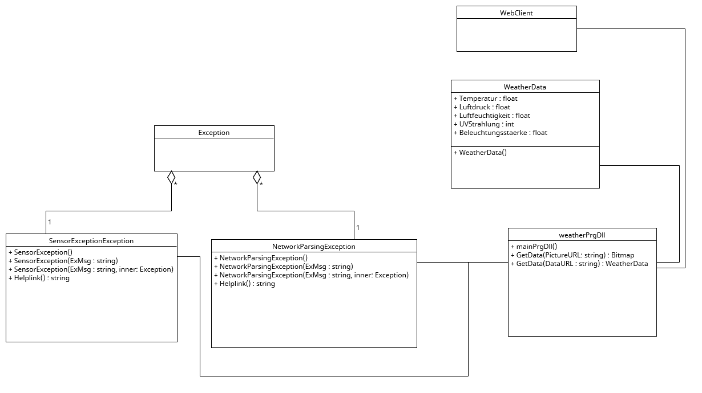

# Schulprojekt OPENSENSE

## Nutzung von Bibliotheken in IDE Visual Studio 2019 Community [OOP + DLL]

## Ziel

In dieser Unterrichtseinheit werden die Lehrplaninhalte [LB 13.6 und 13.7](https://www.schulportal.sachsen.de/lplandb/index.php?lplanid=207&lplansc=RsQZwe8OPkpHBsQONmot&token=cc0766485c53239aace2750645fd4362) mithilfe der Sense-Box Wetterstation, dabei auch der Umgang mit DLLs und OPP in der Praxis umgesetzt. 

Das Ziel dabei ist, diese Lerninhalte zu wiederholen und dabei für die Prüfung zu üben. 

## Aufbau

Eine Wetterstation misst konstant mithilfe von Sensoren verschiedene Umweltparameter. Diese Daten werden durch einen Mikrocomputer zu einem JSON-String verarbeitet und auf einem Webserver gespeichert. Über eine REST-Api können diese Daten nun ausgelesen und in einem Formular angezeigt werden.

## Wetterstation 

Benötigt Hardware: 

- 1x senseBox MCU
- 4x Sensoren 
    - HDC1080 für die Temperatur in  °C
    - BMP280 für die Luftdruck in pa
    - TSL45315 für die Beleichungsstärke in lx
    - VEML6070 für Intensität der ultravioletten Strahlung in μW/cm2
- 1x Outdoor-Gehäuse
- 4x Verbindungskabel 
- 1x USB-Kabel für den Anschluss des Mikrocontrollers an den Computers // Serial Port
- Netzteil und USB Kabel

Benötigt Software: 

- Arduino IDE
- ein Linux Betriebssystem
- NgNix 
- Python Bibliotheken
    - serial 
    - list_ports
    - json 
    - datetime 
    - requests

Die Wetterstation ist wie folgt aufgebaut: Die Sensoren sind mittels 4-Pin Stecker an die Basisplatine angeschlossen. Diese wandelt nun die analog gemessenen Daten in digitale Signale um. Normalerweise sind die Sensoren in einem "Schutztrichter" verbaut um sie vor direkter Beschädigung durch die Umwelt zu schützen. 

Um die Wetterstation zu bedienen wird die Ubuntu 22.04 integrierte Entwicklungsumgebung von Arduino, kurz Arduino IDE, benötigt. Zum Auslesen und bereitstellen der Daten sind einige Python Bibliotheken nötig, sie sind unter Software aufgelistet. 

Der ideale Aufbau der [senseBox:home](https://docs.sensebox.de/misc/senseboxv1/) ist ausführlich unter sensebox.de dokumentiert.

Die Hauptplatine der Wetterstation wird nun über ein serielles Interface mit dem Pi physisch verbunden. Der Pi verarbeitet diese Daten in einen JSON - String und stellt diesen auf Anfrage einem NGINX Webserver bereit. Mit Aufruf der IP-Adresse(http://65.109.108.200/api/v1/senseBox/weather) wird nun der JSON-String angezeigt.
Diese bereitgestellten Daten werden nun mit dem .NET-Framework Webclient heruntergeladen und als Zeichenkette zwischengespeichert. Eine Methode wandelt nun den JSON - String in ein Objekt um. Die einzelnen Attribute dieses Objektes werden nun den Formular-Textfeldern zugeordnet.

Der genaue Ablauf ist unter [‘schulprojekt_OPENSENSE-BOX/UploadData.py’](https://github.com/Gegreenpeaced/schulprojekt_SENSE-BOX/tree/api) zu finden. 

Das folgende Bild WetterstationNetzwerkaufbau veranschaulicht das Netzwerk Routing zwischen den einzelnen Komponenten. 

<figure markdown>
{ width="1000" }
  <figcaption>WetterstationNetzwerkaufbau</figcaption>
</figure>

## API

Eine API (Application Programming Interface) besteht Befehlen, Protokollen ,Funktionen und Objekten, die Programmierer verwenden können, um eine Software zu entwickeln oder mit einem externen System zu interagieren. 
Mittels die API können Anwendungen miteinander kommunizieren. In die API für die Wetterstation kann man beispielsweise die Datenquelle auswählen(die von Markus oder deine eigenen IP-Adresse), wo die entsprechende Daten herkommen [^1].

## Formular

Benötigt Software: 

- VS Studio 2019
- WeatherDll
- .NETFramework 4.7.2

Das Formular besteht aus einer GUI, indem man entsprechende Daten in Echtzeit abfragen kann, sobald der Knopf “Daten Abfragen” gedrückt wird. 
An der ersten Stelle der Methode X wird überprüft, ob eine IP ausgewählt wurde, falls nicht ``(if (string.IsNullOrEmpty(apiIP))`` wird eine Warnung zurückgegeben mit der Anweisung eine IP auszuwählen. Wenn eine gültige IP ausgewählt wurde, werden die entsprechenden Daten in die Textfelder zurückgegeben und ein Infotext mit der Uhrzeit der letzten Abfrage angezeigt. Tritt ein Fehler auf, der in der DLL definiert wurde, wird eine Anweisung zur Fehlerbehebung sowie Ursache angezeigt. Der Algorithmus dahinter ist im folgenden Struktogramm veranschaulicht.

<figure markdown>
{ width="400" }
  <figcaption>WeatherDll</figcaption>
</figure>

Das Programm wird unterbrochen, wenn das Fenster geschlossen oder der Knopf “Close” gedrückt wird. Um ein versehentliches Schließen zu verhindern, wird eine erneute Frage mit Bestätigungsaufforderung gestellt.
Die Struktur ist im folgendem Aktivitätsdiagramm zusammengefasst: 

<figure markdown>
{ width="400" }
  <figcaption>WeatherDll</figcaption>
</figure>

## WeatherDll

Benötigt Software: 

- VS Studio 2019
- Newtonsoft.Json Bibliothek
- .NETFramework 4.7.2

Eine Dynamic Link Library (DLL) enthält Klassen und Methoden, die dynamisch von mehreren Programmen, auch gleichzeitig, benutzt werden können.

Der Inhalt der WeatherDLL ist im folgenden Klassendiagramm veranschaulicht.

<figure markdown>
  { width="1000" }
  <figcaption>WeatherDll</figcaption>
</figure>

---

[^1]: [www.talend.com](https://www.talend.com/de/resources/was-ist-eine-api/), 20.03.2023

[Impressum](legal/imprint.md){ .md-button }
​
